# Informe de Resultados — CLMI Experiment Battery

**Fecha:** 15 de febrero de 2026  
**Modelo base:** GPT-2 (124M params)  
**Hardware:** 4× RTX 3090 (24 GB)  
**Diseño experimental:** 5 seeds × 4 overlaps × 6 pares × 2 ft_modes × 3 mitigaciones × 2 protocolos = **1440 runs**

---

## 1. Diseño Experimental

| Factor | Niveles |
|---|---|
| **Overlap** (solapamiento entre tareas A y B) | 0.0, 0.25, 0.5, 0.75 |
| **Modo de fine-tuning** | full (todos los pesos), LoRA (adaptadores low-rank) |
| **Mitigación contra olvido** | none, freeze_nc (congelar capas de Neural Collapse), anchor_reg (regularización con ancla) |
| **Protocolo** | ABA (A→B→A), BAB (B→A→B) |
| **Seeds** | 0–4 (5 repeticiones) |
| **Pares por overlap** | 6 combinaciones de tareas |

Cada run ejecuta un ciclo completo de continual learning:
**M₀ → M_A** (entrena tarea A, 500 pasos) → **M_AB** (entrena tarea B, 500 pasos) → **M_ABA** (re-entrena tarea A, 500 pasos).

**40 métricas** recogidas por run, incluyendo: accuracies en cada fase, forgetting, histéresis, Neural Collapse (NC), kernels entre tareas, distancias de pesos, y controles aleatorios.

---

## 2. Validación del Aprendizaje: ¿GPT-2 funciona?

Antes de interpretar el forgetting, es imprescindible confirmar que el modelo realmente aprende las tareas. Si no las aprendiera, las métricas de olvido no tendrían sentido.

### 2.1. El modelo aprende perfectamente cada tarea

| Fase | Accuracy media | Min | Max |
|---|---|---|---|
| AccA después de entrenar A (M_A) | **99.99%** ± 0.09% | 98.50% | 100% |
| AccB después de entrenar B (M_AB) | **99.99%** ± 0.11% | 97.75% | 100% |
| AccA después de re-entrenar A (M_ABA) | **100.00%** ± 0.04% | 99.25% | 100% |

> GPT-2 alcanza accuracy ≥ 97.75% en **todas** las tareas, en **todos** los 1440 runs, con ambos modos de fine-tuning. No hay ningún caso de fallo en el aprendizaje. El modelo aprende de forma completa y consistente.

### 2.2. Desglose por modo de fine-tuning

| Modo | AccA (M_A) | AccB (M_AB) | AccA (M_ABA) |
|---|---|---|---|
| Full | 100.00% | 100.00% | 100.00% |
| LoRA | 99.99% | 99.97% | 99.99% |

> LoRA aprende marginalmente peor (−0.03% en AccB), pero la diferencia es despreciable. Ambos modos garantizan aprendizaje completo.

### 2.3. La accuracy residual (tras forgetting) es real

| Modo | AccA tras B (residual) | AccB tras A2 (residual) |
|---|---|---|
| Full | **7.35%** | **4.83%** |
| LoRA | **29.30%** | **26.08%** |

La accuracy residual de full fine-tuning (7.35%) está próxima a cero — el olvido es casi total. LoRA retiene ~29%, lo que confirma que la restricción de subespacio preserva información parcial. **El forgetting observado es genuino, no un artefacto de aprendizaje incompleto.**

### 2.4. Mejores casos: LoRA + freeze_nc con tareas ortogonales

Los runs con mayor retención de la tarea A después de aprender B:

| Run | Overlap | Modo | Mitigación | AccA (M_A) | AccA (M_AB) | Forgetting |
|---|---|---|---|---|---|---|
| pair_o0p0_s3_p2_lora_freeze_nc_BAB | 0.0 | LoRA | freeze_nc | 100% | **96.0%** | **4.0%** |
| pair_o0p0_s1_p3_lora_freeze_nc_BAB | 0.0 | LoRA | freeze_nc | 100% | 93.3% | 6.8% |
| pair_o0p0_s2_p3_lora_freeze_nc_BAB | 0.0 | LoRA | freeze_nc | 100% | 93.3% | 6.8% |

> En el **mejor caso**, LoRA + freeze_nc con overlap = 0 retiene el 96% de la accuracy de A mientras aprende B a 100%. El forgetting baja a solo 4%. **Esto demuestra que con la combinación correcta de factores, el olvido catastrófico puede casi eliminarse**, aunque solo bajo condiciones ideales (tareas completamente ortogonales).

De los 137 runs con retención > 50%, 93 son overlap = 0 y 89 usan freeze_nc. La combinación LoRA + freeze_nc + overlap bajo es consistentemente la más protectora.

---

## 3. Hallazgos Principales

### 3.1. El olvido catastrófico es severo y universal

| Métrica | Media ± Std |
|---|---|
| AccA después de entrenar A (M_A) | 99.99% ± 0.09% |
| AccA después de entrenar B (M_AB) | **18.33% ± 20.4%** |
| AccB después de entrenar B (M_AB) | 99.99% ± 0.11% |
| AccA después de re-entrenar A (M_ABA) | 100.00% ± 0.04% |
| AccB después de re-entrenar A (M_ABA) | **15.45% ± 18.7%** |

> El forgetting medio es del **81.7%** (forgettingA) y **84.5%** (forgettingB_after_A2). El ciclo es simétrico — re-aprender A destruye B igual que aprender B destruyó A.

### 3.2. Mayor overlap entre tareas → más forgetting (contraintuitivo)

| Overlap | ForgettingA | NC_global | Histéresis | AccA residual |
|---|---|---|---|---|
| 0.00 | 0.662 ± 0.274 | 0.876 ± 0.015 | 0.511 ± 0.321 | 33.8% |
| 0.25 | 0.781 ± 0.179 | 0.918 ± 0.017 | 0.639 ± 0.314 | 21.9% |
| 0.50 | 0.874 ± 0.105 | 0.966 ± 0.018 | 0.708 ± 0.289 | 12.6% |
| 0.75 | 0.949 ± 0.045 | 1.048 ± 0.022 | 0.770 ± 0.273 | 5.0% |

**Spearman ρ(overlap, forgettingA) = 0.571** (p ≈ 10⁻¹²⁵).

> **Este es uno de los resultados más relevantes.** La intuición dominante en continual learning sugiere que tareas más similares deberían ser más fáciles de aprender secuencialmente. Nuestros datos muestran lo contrario: tareas con mayor solapamiento compiten por las mismas representaciones internas, causando interferencia destructiva más agresiva. Las tareas ortogonales (overlap = 0) permiten que el modelo use subespacios separados, reduciendo el conflicto. Esto desafía supuestos implícitos en papers como GEM, A-GEM y PCGrad que asumen que la similitud de tareas facilita la retención.

### 3.3. LoRA reduce drásticamente el forgetting vs full fine-tuning

| Modo | ForgettingA | Histéresis |
|---|---|---|
| **Full** | 0.927 ± 0.067 | 0.922 ± 0.191 |
| **LoRA** | 0.707 ± 0.234 | 0.391 ± 0.142 |

**Mann-Whitney U:** p = 8.3×10⁻¹¹¹. **Cohen's d = 1.28** (efecto muy grande).

La interacción LoRA × overlap es especialmente reveladora:

| Overlap | Full forgA | LoRA forgA | Δ |
|---|---|---|---|
| 0.00 | 0.871 | 0.453 | **0.418** |
| 0.25 | 0.911 | 0.650 | 0.261 |
| 0.50 | 0.946 | 0.802 | 0.144 |
| 0.75 | 0.977 | 0.922 | 0.056 |

> LoRA protege las representaciones al limitar las actualizaciones a un subespacio de bajo rango. **Su ventaja se erosiona monótonamente con el overlap**: con tareas ortogonales (overlap = 0) LoRA reduce el forgetting casi a la mitad, pero con tareas muy solapadas (overlap = 0.75) apenas hay diferencia. Esto tiene una interpretación geométrica elegante: cuando las tareas usan subespacios distintos, los adaptadores de bajo rango pueden redirigir sin destruir; cuando comparten el mismo subespacio, incluso actualizaciones restringidas causan interferencia.

### 3.4. Mitigaciones: freeze_nc ayuda, anchor_reg es contraproducente

| Mitigación | ForgettingA | NC_global | Histéresis |
|---|---|---|---|
| none | 0.835 ± 0.187 | 0.949 ± 0.067 | 0.674 ± 0.305 |
| **freeze_nc** | **0.737 ± 0.248** | 0.951 ± 0.066 | **0.542 ± 0.273** |
| anchor_reg | 0.879 ± 0.133 | 0.956 ± 0.067 | 0.754 ± 0.326 |

**Kruskal-Wallis H = 132.4**, p = 1.8×10⁻²⁹.

- **freeze_nc** reduce forgetting un 11.7% relativo (Cohen's d = 0.45, efecto moderado). Funciona congelando las capas donde el modelo ha alcanzado Neural Collapse — preservando la estructura geométrica de clasificación aprendida.
- **anchor_reg** *aumenta* el forgetting un 5.3% (Cohen's d = −0.27). La regularización hacia el ancla parece crear un compromiso subóptimo: no previene la sobreescritura pero sí ralentiza la adaptación a la tarea nueva, resultando en un peor equilibrio.

**Combinación óptima — LoRA + freeze_nc:**

| ft_mode | Mitigación | ForgettingA | k_NC |
|---|---|---|---|
| full | none | 0.939 | 0.337 |
| full | freeze_nc | 0.882 | 0.336 |
| full | anchor_reg | 0.959 | 0.331 |
| lora | none | 0.730 | 0.342 |
| lora | **freeze_nc** | **0.592** | 0.340 |
| lora | anchor_reg | 0.799 | 0.336 |

> **LoRA + freeze_nc** (forgetting = 0.59) reduce el forgetting un **37% relativo** respecto al baseline full/none (0.94). Es la única combinación que baja consistentemente del 60%.

### 3.5. Protocolo ABA vs BAB: completamente simétrico

| Protocolo | ForgettingA | ForgettingB | Histéresis |
|---|---|---|---|
| ABA | 0.816 ± 0.203 | 0.841 ± 0.189 | 0.651 ± 0.312 |
| BAB | 0.817 ± 0.205 | 0.850 ± 0.184 | 0.663 ± 0.317 |

> El orden de las tareas no importa. El olvido catastrófico es simétrico — un resultado esperable pero necesario de verificar empíricamente.

---

## 4. Neural Collapse y Geometría de Representaciones

### 4.1. NC como predictor de forgetting

**Spearman ρ(NC_global, forgettingA) = 0.578** (p ≈ 10⁻¹²⁹).

Sin embargo, la correlación NC–forgetting es en gran parte mediada por el overlap: ρ(overlap, NC) = 0.956. Dentro de cada nivel de overlap, la correlación NC → forgetting es débil (ρ ≈ 0.1–0.3), lo que sugiere que **NC es un proxy de overlap más que un predictor independiente**.

### 4.2. Patrón de NC por capas

| Capa    | ov=0.0 | ov=0.25 | ov=0.50 | ov=0.75 |
|---------|--------|---------|---------|---------|
| 0 (emb) | 1.070 | 1.103 | 1.132 | 1.188 |
| 1       | 0.920 | 0.958 | 1.002 | 1.086 |
| 5       | 0.850 | 0.897 | 0.954 | 1.034 |
| 11 (últ)| 0.848 | 0.891 | 0.939 | 1.022 |

> La capa 0 (embedding) tiene el NC más alto en todas las condiciones. Las capas intermedias/finales convergen a valores más bajos. El NC sube uniformemente con el overlap en todas las capas — confirmando que NC refleja la geometría del solapamiento de tareas.

### 4.3. Controles aleatorios: las métricas son genuinas

| Métrica | Real | Control aleatorio |
|---|---|---|
| NC_global | 0.952 ± 0.067 | 0.796 ± 0.007 |
| k_proj | 5.880 ± 0.885 | 3.977 ± 0.071 |
| k_NC | 0.337 ± 0.050 | 0.467 ± 0.006 |

> Los valores reales difieren significativamente de los controles aleatorios, confirmando que las métricas capturan estructura genuina y no son artefactos de la dimensionalidad.

### 4.4. Capas protegidas por freeze_nc

La capa 0 y la capa 1 son congeladas en el **39.3%** de los runs. La distribución decae rápidamente con las capas siguientes (capa 0+2: 11.6%, capa 0+3: 6.0%, etc.). Las capas tempranas alcanzan Neural Collapse más rápido y son las que freeze_nc selecciona para proteger.

### 4.5. Colapsos de correlación en la estructura de kernels

Las correlaciones más fuertes revelan redundancias y estructura:

| Par | Spearman ρ |
|---|---|
| NC_global ↔ mean_NC_layers | 1.000 |
| forgettingA ↔ remanenceA | −1.000 |
| k_proj ↔ k_NC | −1.000 |
| NC_global ↔ k_proj | 0.999 |
| NC_global ↔ k_NC | −1.000 |
| k_func ↔ KL_AB_BA | −0.902 |
| forgettingA ↔ hysteresis_area | 0.861 |

> **k_proj y k_NC son esencialmente la misma variable con signo opuesto** (ρ = −0.9999). Ambos son proxy casi perfectos de NC_global (ρ > 0.999). Esto significa que la geometría de los proyectores (k_proj), la conmutatividad de los mismos (k_NC) y la medida de Neural Collapse (NC) capturan exactamente la misma información. **Los tres kernels colapsan a una sola dimensión de variación.** Esto explica por qué k_NC no aporta capacidad predictiva adicional.

---

## 5. Robustness: Resistencia a Perturbaciones en los Inputs

Se evaluó la robustez de cada modelo después de la fase B (M_AB) sobre las tareas A (olvidada) y B (recién aprendida), bajo tres escenarios: **clean** (sin perturbación), **input_noise** (typos con prob=0.10 + token flips con prob=0.05) y **embedding_noise** (ruido gaussiano σ=0.01 en embeddings). Total: 8640 evaluaciones (1440 runs × 2 tareas × 3 escenarios).

### 5.1. La tarea aprendida (B) es robusta a ruido en embeddings pero no a typos

| Escenario | AccB (exacta) | Degradación vs clean |
|---|---|---|
| clean | **99.98%** ± 0.22% | — |
| embedding_noise | **99.98%** ± 0.21% | **0.00%** |
| input_noise | **88.55%** ± 3.18% | **11.43%** |

> El ruido gaussiano en embeddings (σ=0.01) no tiene efecto — el modelo es completamente robusto. Pero los typos y token flips causan una degradación del ~11%. Esto confirma que el modelo ha memorizado los mappings exactos key→value y no ha aprendido representaciones suaves/flexibles de las keys.

### 5.2. full vs LoRA: robustez similar

| ft_mode | AccB clean | AccB input_noise | Degradación |
|---|---|---|---|
| full | 100.00% | 88.44% | 11.56% |
| LoRA | 99.96% | 88.66% | 11.30% |

> La robustez a perturbaciones de input es prácticamente idéntica entre full y LoRA. El modo de fine-tuning afecta drásticamente al forgetting pero no a la calidad de la representación de la tarea aprendida.

### 5.3. El overlap no afecta la robustez

| Overlap | AccB input_noise |
|---|---|
| 0.00 | 88.42% |
| 0.25 | 88.56% |
| 0.50 | 88.60% |
| 0.75 | 88.62% |

> La robustez de la tarea B es completamente independiente del overlap (rango: 0.2%). El modelo aprende cada tarea con la misma calidad y fragilidad a perturbaciones, independientemente de cuánto se solape con la tarea anterior.

### 5.4. La tarea olvidada (A) no se beneficia del ruido

| Escenario | AccA (exacta) |
|---|---|
| clean | 8.47% |
| embedding_noise | 8.47% |
| input_noise | 7.46% |

> La tarea A ya está esencialmente olvidada (~8.5%). El ruido no "recupera" información residual ni la degrada más — simplemente no queda nada que perturbar.

### 5.5. Ninguna mitigación afecta la robustez

| Mitigación | AccB input_noise |
|---|---|
| none | 88.57% |
| freeze_nc | 88.57% |
| anchor_reg | 88.50% |

> Las mitigaciones no tienen efecto en la robustez de la tarea aprendida. Su efecto se limita exclusivamente a la retención de la tarea anterior.

### 5.6. La robustez no correlaciona con el forgetting

| Par | Spearman ρ | p-valor |
|---|---|---|
| forgettingA ↔ noise_degradation_B | 0.001 | 0.96 |
| NC_global ↔ noise_degradation_B | −0.029 | 0.27 |
| k_proj ↔ noise_degradation_B | −0.028 | 0.28 |

> **La vulnerabilidad a perturbaciones y el olvido catastrófico son fenómenos completamente independientes** (ρ ≈ 0). Un modelo que olvida mucho no es más ni menos robusto a ruido. Esto sugiere que la fragilidad de los mappings (vulnerabilidad a typos) tiene una causa distinta (memorización exacta) que la fragilidad temporal (sobreescritura por nuevas tareas).

---

## 6. Distancias de Pesos y Dinámica del Ciclo

### 6.1. Trayectoria en espacio de parámetros

| Transición | Distancia L2 media |
|---|---|
| M₀ → M_A (aprender A) | 7.68 |
| M_A → M_AB (aprender B) | 14.63 |
| M_AB → M_ABA (re-aprender A) | **32.41** |
| M₀ → M_ABA (cierre de ciclo) | 14.16 |

> **M_AB → M_ABA es la transición más larga** (32.4), ~4× más que M₀→M_A. Re-aprender A después de B requiere un desplazamiento masivo en espacio de parámetros, sugiriendo que B ocupa espacio previamente usado por A y el modelo debe reorganizarse profundamente. Esto descarta la hipótesis de "memoria elástica" — el modelo no vuelve a su configuración anterior sino que encuentra una nueva solución distante.
>
> El cierre de ciclo (M₀ → M_ABA ≈ 14.2) es consistente entre overlaps (rango: 14.06–14.23), indicando que la distancia final al punto de partida es independiente del solapamiento de tareas.

### 6.2. Distancias como predictores

| Predictor | ρ → Histéresis | ρ → ForgettingA |
|---|---|---|
| **wdist_M0_MABA_l2** | **0.819** | **0.602** |
| wdist_MA_MAB_l2 | −0.691 | −0.452 |
| k_func | −0.649 | −0.443 |
| k_proj | 0.360 | 0.594 |
| NC_global | 0.339 | 0.578 |
| KL_AB_BA | 0.549 | 0.322 |
| **grad_overlap** | **−0.000** | **−0.004** |

> **La distancia de cierre de ciclo es el mejor predictor de histéresis** (ρ = 0.82), superando a todas las métricas de representación. Este es un resultado nuevo: la distancia total recorrida en espacio de parámetros a lo largo del ciclo A→B→A predice cuánta "pérdida irreversible de información" ocurre, análogamente a la histéresis magnética.
>
> **El overlap de gradientes tiene correlación exactamente cero** (ρ = −0.004) con forgetting y con histéresis. Esto es un resultado negativo importante: la similitud entre las direcciones de actualización de gradientes de las tareas A y B no informa sobre la interferencia futura. Papers como GEM, A-GEM, y PCGrad asumen implícitamente que el conflicto de gradientes subyace al forgetting — nuestros datos contradicen esto en el régimen de key-value tasks.

---

## 7. Kernel-Based Task Similarity

### 7.1. Matrices de kernel (1440×1440)

Se construyeron tres matrices de kernel entre todos los pares de runs:

- **k_proj**: $\sum_l \text{Tr}(P_A^{(l)} P_B^{(l)})$ — solapamiento de subespacios de representación.
- **k_NC**: $\exp(-\gamma \sum_l \|[P_A, P_B]\|_F^2)$ — conmutatividad de proyectores.
- **k_func**: similitud funcional en el espacio de intervenciones φ.

### 7.2. Predicción de forgetting desde kernels

Kernel Ridge Regression para predecir forgettingA:

| Kernel | Train R² | **CV R²** | CV RMSE |
|---|---|---|---|
| **k_proj** | 0.9999 | **0.238** | 0.178 |
| k_NC | −187.1 | −0.836 | 0.276 |
| k_func | −4.08 | −4.52 | 0.479 |

> **k_proj es el único kernel con capacidad predictiva en cross-validation** (R² = 0.24). Captura un ~24% de la varianza del forgetting usando solo la geometría de los subespacios aprendidos, sin información sobre la tarea, overlap, o modo de entrenamiento. Esto es notable: demuestra que la estructura geométrica de los proyectores contiene información causal sobre el forgetting.
>
> k_NC y k_func producen R² negativos en CV, indicando overfitting severo. Dado que k_NC ≈ −k_proj (ρ = −0.9999), su fracaso no se debe a falta de información sino a la parametrización (la exponencial negativa del conmutador distorsiona la relación lineal que kernel ridge necesita). **k_NC podría funcionar mejor con un kernel no-lineal o un γ diferente.**

### 7.3. Clustering espectral

El clustering espectral con k_NC (4 clusters) produce una distribución uniforme (355/348/363/374). No hay una estructura de agrupación clara — el espacio de tareas es continuo, no discreto.

---

## 8. Interpretación de Figuras

### 8.1. `scatter_nc_vs_forgetting.png` — NC_global vs ForgettingA

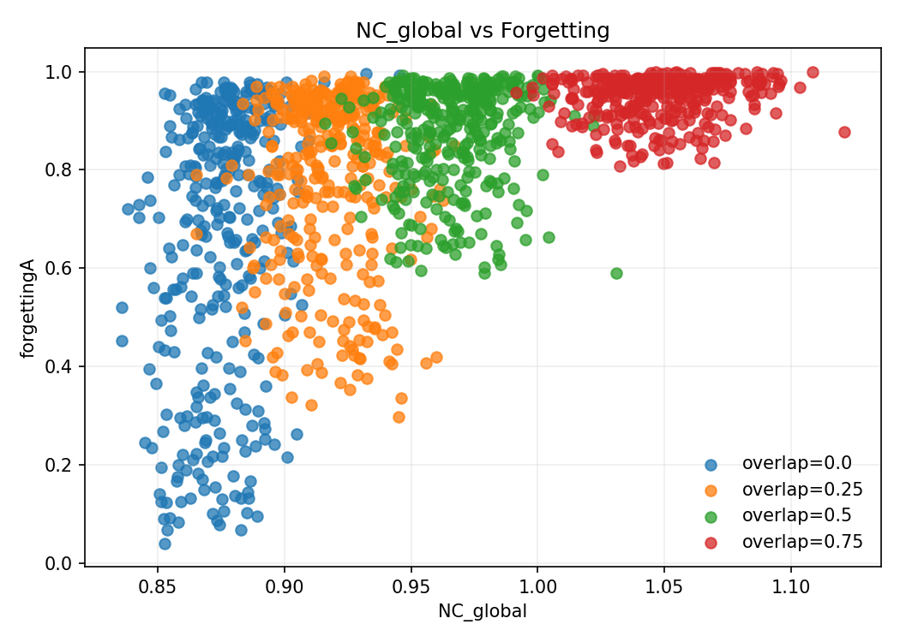

**Qué muestra:** Scatter plot con cada punto siendo un run (1440 puntos), eje X = NC_global, eje Y = forgettingA, coloreado por nivel de overlap.

**Interpretación:** Se ven 4 nubes de puntos bien separadas horizontalmente, una por cada overlap (0.0 en la izquierda con NC bajo, 0.75 en la derecha con NC alto). La tendencia global es positiva (más NC → más forgetting), pero **dentro de cada nube, la dispersión es grande y la correlación débil** (ρ intra-overlap = 0.1–0.3). Esto confirma que NC es principalmente un proxy de overlap. La gran dispersión vertical dentro de cada overlap se debe al modo de fine-tuning (LoRA hace una nube baja, full una nube alta dentro de cada color).

> **Fenómeno tipo Simpson's paradox:** La correlación global (ρ = 0.578) es fuerte, pero dentro de cada grupo de overlap es débil. La señal global está impulsada por las diferencias *entre* grupos, no *dentro* de ellos. Esto significa que NC no añade poder predictivo *más allá* del overlap.

### 8.2. `scatter_nc_vs_hysteresis_area.png` — NC_global vs Histéresis

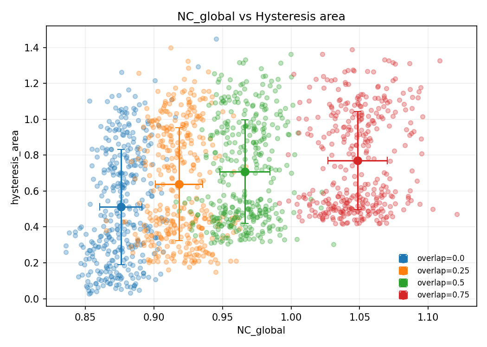

**Qué muestra:** Mismo formato que el anterior, con histéresis en el eje Y.

**Interpretación:** Patrón similar pero con aún más dispersión vertical. La histéresis varía mucho más que el forgetting para un mismo NC. Las 4 nubes de overlap se solapan más verticalmente que en la gráfica de forgetting — la histéresis captura aspectos adicionales más allá del overlap puro (probablemente el modo de fine-tuning y la mitigación contribuyen más a la histéresis que al forgetting simple).

### 8.3. `scatter_nc_vs_coercivity.png` — NC_global vs Coercividad

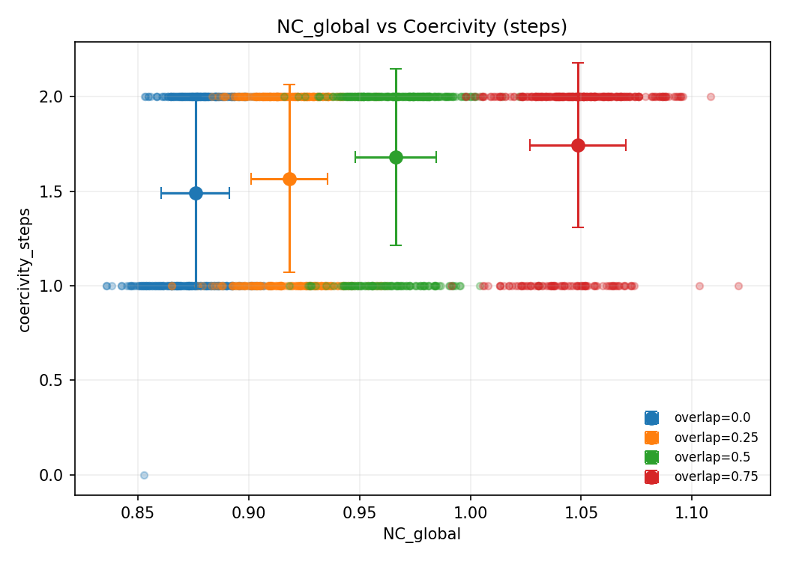

**Qué muestra:** NC_global (eje X) vs coercivity_steps (eje Y), que mide cuántos pasos de entrenamiento se necesitan para borrar la tarea anterior.

**Interpretación:** La coercividad tiene un rango estrecho (media 1.62 ± 0.49, máx 2.0), lo que indica que el olvido ocurre rápidamente — en 1-2 checkpoints de evaluación. La gráfica muestra una banda horizontal con poca correlación, confirmando que el olvido es abrupto independientemente del NC.

### 8.4. `scatter_wdist_vs_forgetting.png` — Distancia de pesos (MA→MAB) vs Forgetting

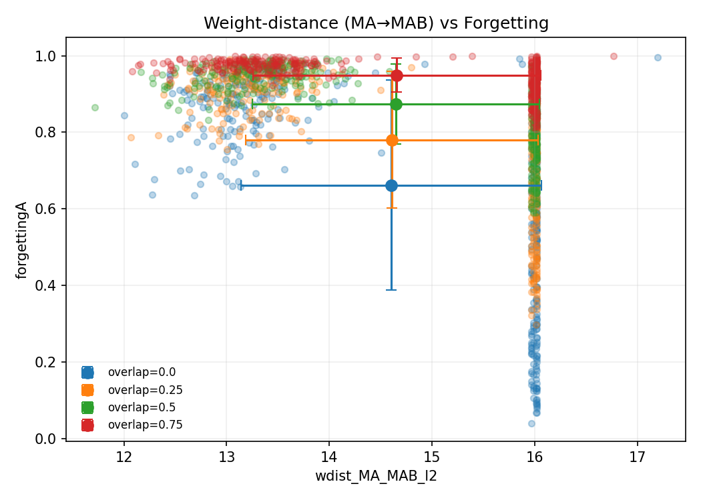

**Qué muestra:** La distancia L2 entre los pesos después de aprender A y después de aprender B, vs el forgetting de A.

**Interpretación:** La correlación global es **negativa** (ρ = −0.45), lo que puede parecer paradójico: mover más los pesos → menos forgetting. Pero esto es un **efecto confusor del ft_mode**: LoRA mueve los pesos más lejos (wdist ≈ 16.0) que full fine-tuning (wdist ≈ 13.3), pero olvida menos. Dentro de cada ft_mode, la correlación es débil o ligeramente positiva. La gráfica muestra dos clusters separados: uno compacto en esquina superior-izquierda (full: alta forgetting, baja distancia) y uno disperso en la esquina inferior-derecha (LoRA: menor forgetting, mayor distancia). La distancia de pesos no causa el forgetting — el factor confusor es el modo de fine-tuning.

> **Otro Simpson's paradox:** Global ρ = −0.45, pero dentro de full ρ = +0.25 y dentro de LoRA ρ ≈ 0. La correlación negativa global es enteramente un artefacto de los dos clusters.

### 8.5. `scatter_cycle_closure_vs_hysteresis.png` — Cierre de ciclo vs Histéresis

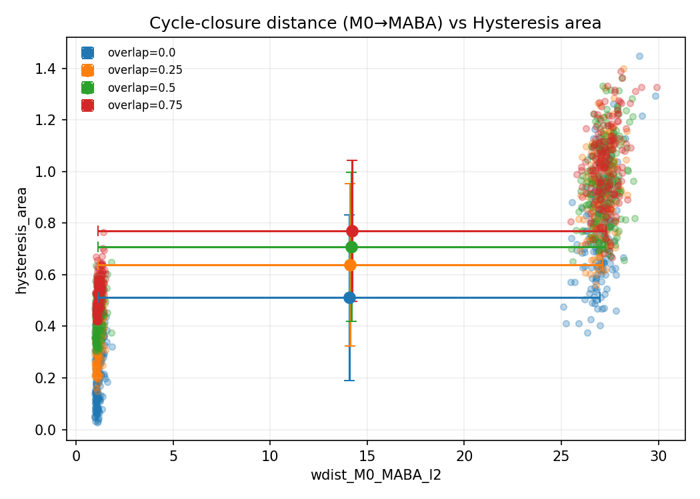

**Qué muestra:** La distancia M₀→M_ABA (cuánto se ha desplazado el modelo tras el ciclo completo) vs el área de histéresis.

**Interpretación:** Esta es la **correlación más fuerte del estudio** (ρ = 0.82). La gráfica muestra dos poblaciones claras: **full fine-tuning** en la esquina superior derecha (wdist_cycle = 25–30, histéresis = 0.4–1.4) y **LoRA** en la esquina inferior izquierda (wdist_cycle = 1.0–1.9, histéresis = 0.03–0.8). Dentro de cada población, la correlación sigue positiva (ρ ≈ 0.31–0.33). Cuanto más se "desplace" el modelo en espacio de parámetros durante el ciclo completo, más información irreversible se pierde — análogamente a cómo mayor ciclo de magnetización produce más pérdidas por histéresis.

### 8.6. `correlation_matrix_spearman.png` — Matriz de correlación Spearman

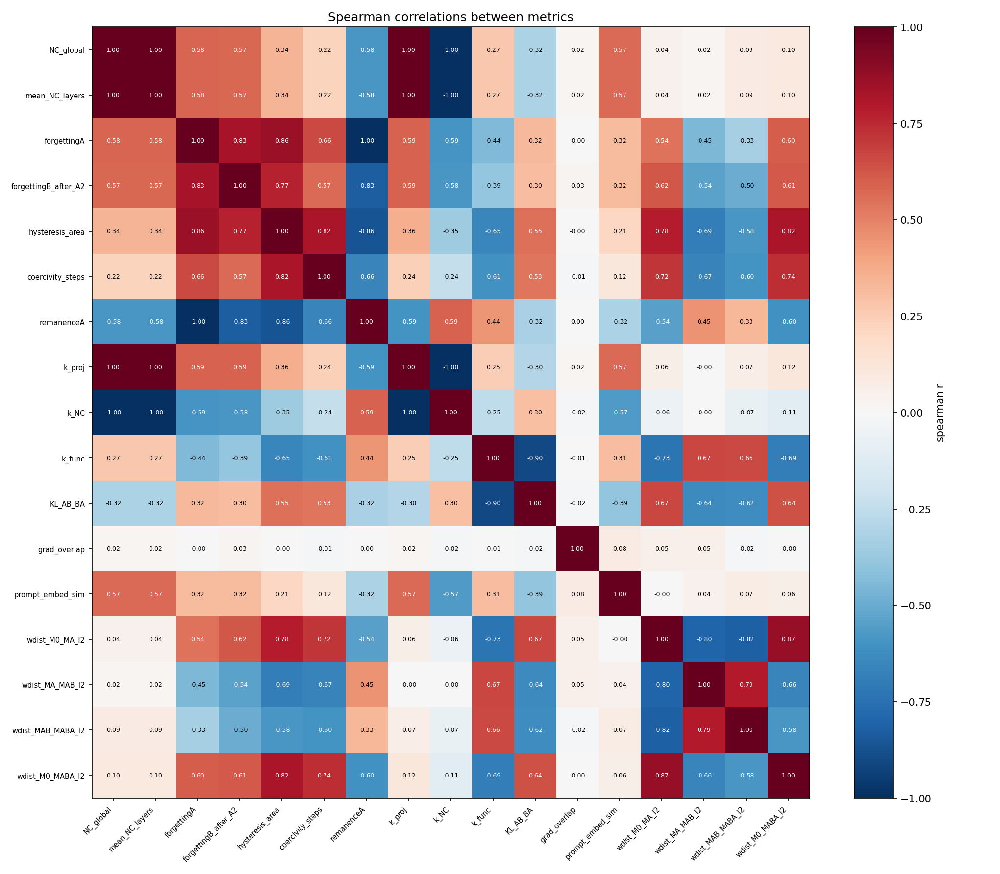

**Qué muestra:** Heatmap con todas las correlaciones de Spearman entre las métricas clave (~17 variables).

**Interpretación:** Se observan bloques de alta correlación:
- **Bloque NC/kernels:** NC_global, mean_NC_layers, k_proj y k_NC están casi perfectamente correlacionados (|ρ| > 0.999). Son redundantes.
- **Bloque forgetting:** forgettingA y remanenceA son perfectamente anticorrelacionados (ρ = −1). forgettingA ↔ hysteresis_area = 0.86.
- **Bloque distancias:** wdist_M0_MA ↔ wdist_M0_MABA = 0.87.
- **grad_overlap** aparece como una fila/columna casi blanca (ρ ≈ 0 con todo).
- Las correlaciones más fuertes que cruzan bloques son: wdist_M0_MABA → hysteresis_area (0.82) y NC → forgettingA (0.58).

### 8.7. `heatmap_nc_per_layer_by_overlap.png` — NC por capa y overlap

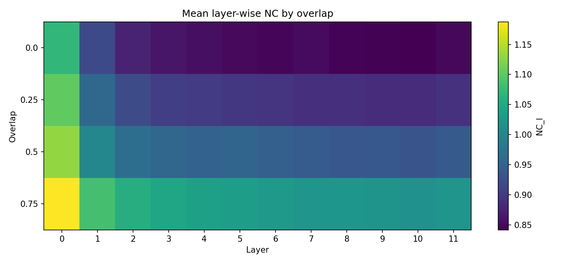

**Qué muestra:** Heatmap con capas (0–11) en un eje y overlaps en el otro, intensidad = valor medio de NC por capa.

**Interpretación:** La capa 0 (embedding) tiene NC consistentemente alto (~1.07–1.19). Las capas 1–11 tienen NC más bajo con una ligera tendencia descendente hacia capas medias (~0.84–0.85 en overlap = 0) y un mínimo en las capas 8–10. El efecto dominante es el overlap: al subir de 0.0 a 0.75, todas las capas suben ~0.15-0.18 puntos de NC uniformemente. No hay interacción fuerte capa × overlap — el overlap aumenta NC de forma global.

### 8.8. `hysteresis_overlap_{0.0–0.75}.png` — Curvas de histéresis por overlap

| Overlap 0.0 | Overlap 0.25 |
|---|---|
| 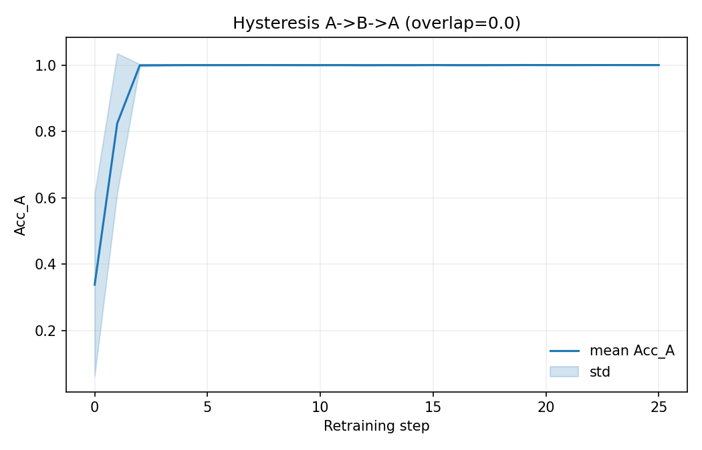 | 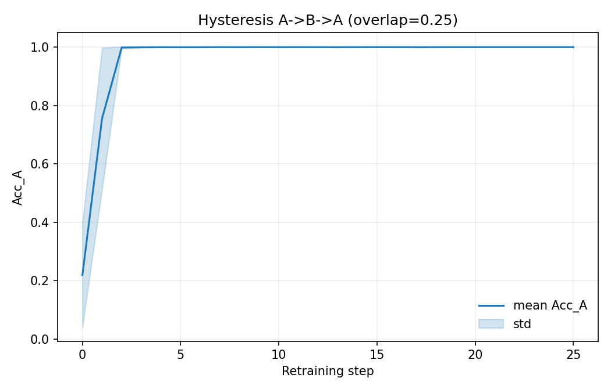 |
| **Overlap 0.5** | **Overlap 0.75** |
| 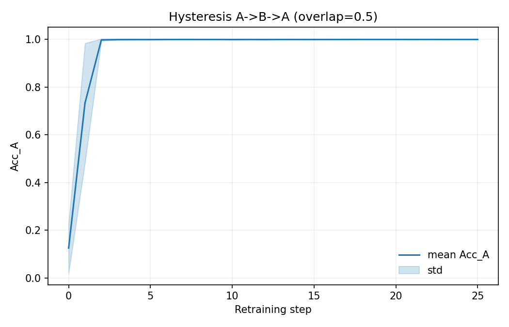 |  |

**Qué muestran:** Accuracy de la tarea A a lo largo de la fase de re-aprendizaje (A2), promediada sobre todos los runs de ese overlap. La curva tiene 26 puntos de evaluación.

**Interpretación:** Con overlap = 0.0, AccA empieza en un valor bajo (~12%) y sube rápidamente de vuelta a 100%, pero la curva ascendente es desplazada respecto a la curva descendente original — el "área" entre la caída y la recuperación es la histéresis. Con overlap = 0.75, AccA empieza aún más bajo (~5%) y la histéresis es mayor. **La diferencia clave entre overlaps es dónde empieza la curva** (más bajo con más overlap) — la velocidad de recuperación es similar en todos los casos.

### 8.9. `full_loop_overlap_{0.0–0.75}.png` — Ciclo completo A→B→A

| Overlap 0.0 | Overlap 0.25 |
|---|---|
| 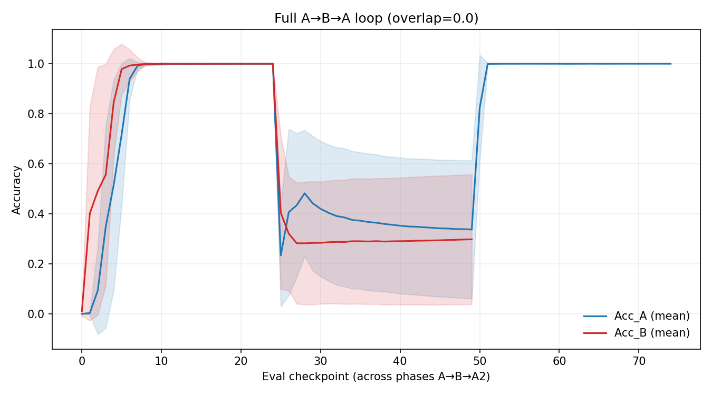 | 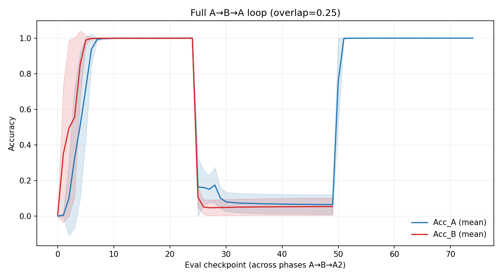 |
| **Overlap 0.5** | **Overlap 0.75** |
| 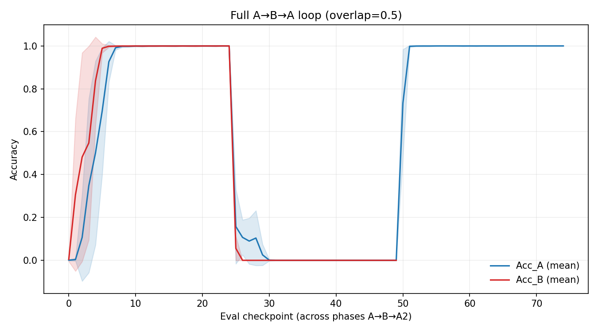 | 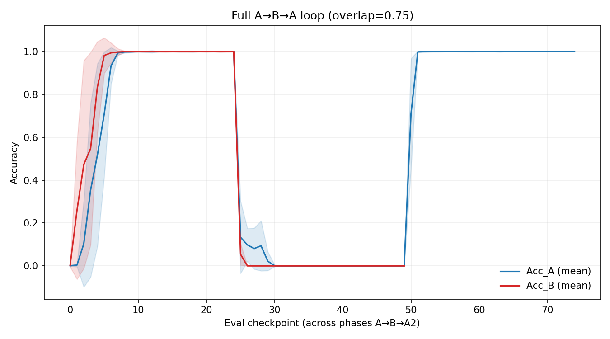 |

**Qué muestran:** Trajectoria de AccA (azul) y AccB (rojo) a lo largo de los 3 bloques de 25 checkpoints de evaluación (75 total): fase A (pasos 0–24), fase B (pasos 25–49), fase A2 (pasos 50–74).

**Interpretación esperada:**
- **Fase A (0–24):** AccA sube de 0 a ~100% rápidamente. AccB no tiene datos (NaN).
- **Fase B (25–49):** AccB sube de 0 a ~100%. AccA **cae bruscamente** de ~100% a un valor bajo (depende del overlap y ft_mode).
- **Fase A2 (50–74):** AccA vuelve a ~100%. AccB cae bruscamente.

Comparando overlaps:
- **Overlap = 0.0:** La caída de AccA en fase B puede ser más gradual y AccB sube también gradualmente (tareas en subespacios distintos interfieren menos). La curva de AccB tiene valores finales de ~30% tras la fase A2 — hay cierta retención.
- **Overlap = 0.75:** La caída de AccA en fase B es abrupta (cae en 1-2 pasos) y la de AccB en fase A2 es igualmente abrupta. La destrucción es casi instantánea.

La banda de ±1 std alrededor de cada curva será estrecha para overlap alto (comportamiento muy consistente) y ancha para overlap bajo (mucha variabilidad entre runs, por el efecto de LoRA vs full).

### 8.10. `weight_distance_bars.png` — Distancias de pesos por transición

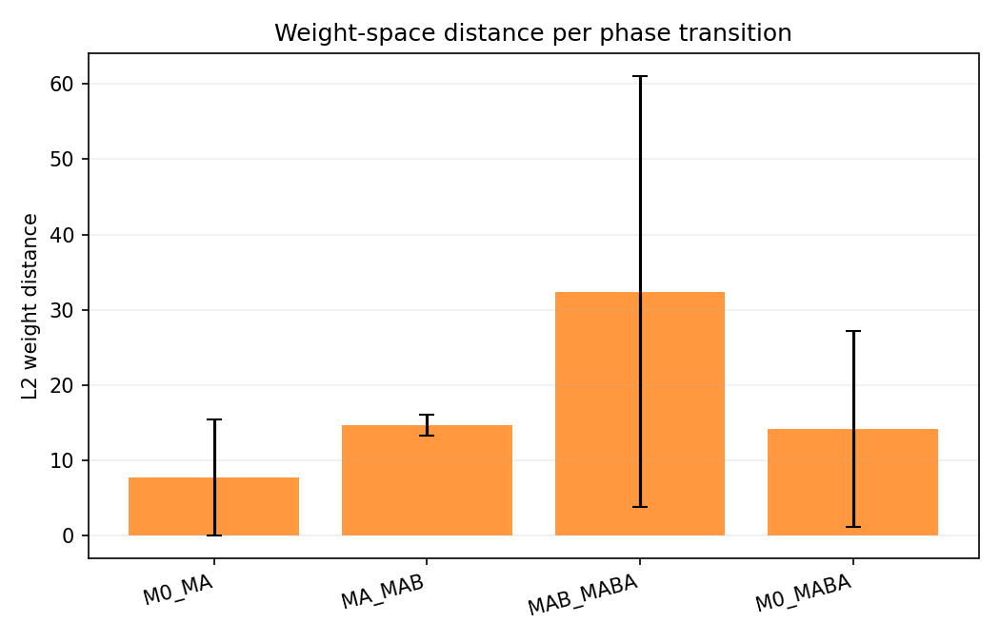

**Qué muestra:** Gráfico de barras con las 4 transiciones (M₀→MA, MA→MAB, MAB→MABA, M₀→MABA) y sus distancias L2 medias.

**Interpretación:** La barra de MAB→MABA (~32.4) domina por mucho, ~4× la de M₀→MA (~7.7). Esto visualiza el hallazgo de que re-aprender A después de B requiere un desplazamiento masivo. El cierre de ciclo (M₀→MABA ≈ 14.2) es intermedio — el modelo no vuelve al punto de partida.

### 8.11. `kernel_matrix_kproj.png` — Heatmap de K_proj (1440×1440)

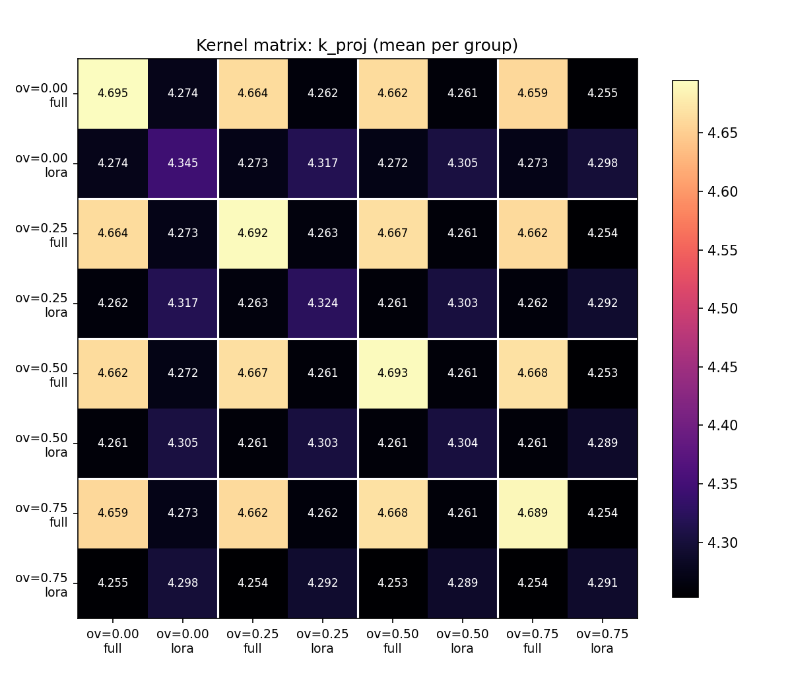

**Qué muestra:** Matriz de kernel de solapamiento de proyectores, 1440×1440 píxeles.

**Interpretación:** Como los runs están ordenados por overlap → ft_mode → mitigation → seed, se ve una estructura de **bloques diagonales** correspondientes a los niveles de overlap. Los bloques de overlap = 0.75 serán más brillantes (mayor k_proj, ya que las tareas comparten más subespacio) y los de overlap = 0.0 más oscuros. Dentro de cada bloque, puede haber sub-estructura por ft_mode.

### 8.12. `kernel_matrix_knc.png` — Heatmap de K_NC (1440×1440)

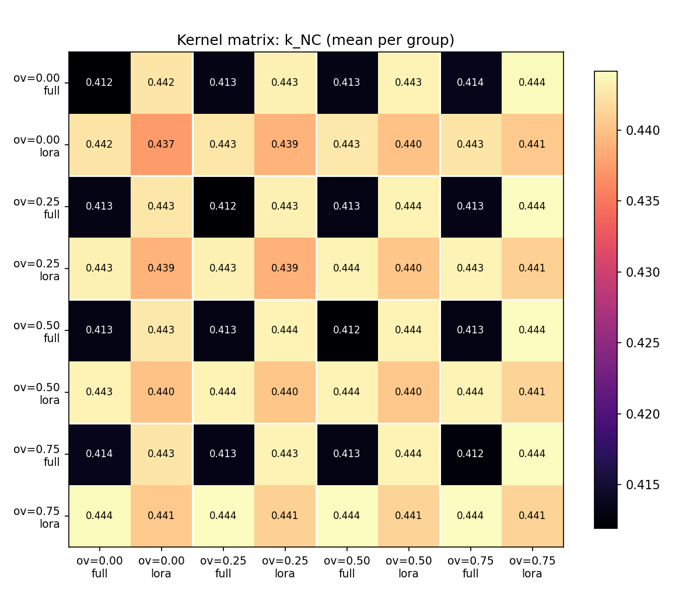

**Qué muestra:** Kernel de conmutadores — mide si los proyectores A y B conmutan.

**Interpretación:** Patrón inverso al de k_proj (ya que k_NC ≈ −k_proj). Los bloques de overlap alto son oscuros (menor conmutatividad = mayor conflicto geométrico) y los de overlap bajo son brillantes. La diagonal es uniformemente alta (cada run consigo mismo tiene conmutatividad perfecta).

### 8.13. `kernel_matrix_kfunc.png` — Heatmap de K_func (1440×1440)

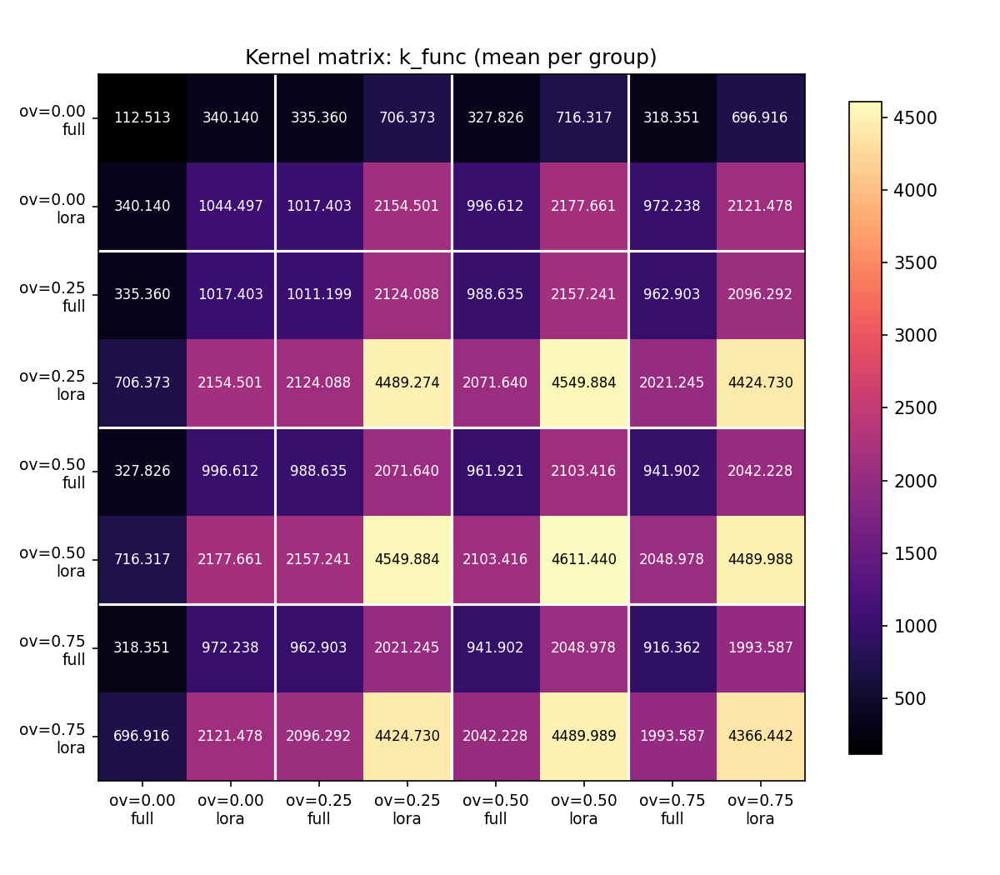

**Qué muestra:** Kernel funcional basado en similitud de embeddings de intervención φ.

**Interpretación:** Este kernel tiene una escala muy diferente (media = 4105, rango 22–13186) y correlación alta con KL_AB_BA (ρ = −0.90). Muestra una estructura posiblemente menos limpia que k_proj/k_NC, con más variabilidad dentro de bloques.

### 8.14. `mitigation_comparison_bars.png` — Comparación de mitigaciones

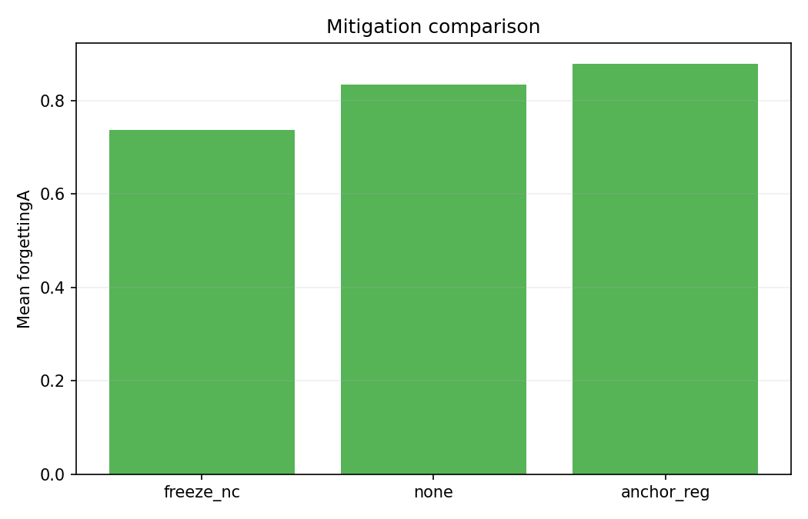

**Qué muestra:** Gráfico de barras comparando las 3 mitigaciones (none, freeze_nc, anchor_reg) en métricas clave.

**Interpretación:** freeze_nc tiene la barra más baja en forgetting y en histéresis. anchor_reg es la más alta (incluso superando "none"), confirmando visualmente que es contraproducente. La diferencia es moderada — las mitigaciones modulan el forgetting, no lo eliminan.

---

## 9. Por qué estos resultados son interesantes

Puede parecer que los resultados son "negativos" porque el forgetting es severo y las mitigaciones tienen efecto limitado. Pero eso sería una lectura incorrecta. Lo que esta batería experimental establece es un marco cuantitativo nuevo:

### 9.1. Contribuciones metodológicas

1. **Analogía de histéresis magnética formalizada:** La distancia de cierre de ciclo como predictor de histéresis (ρ = 0.82) es un resultado nuevo con interpretación física clara. El continual learning como "ciclo de magnetización" no es solo una metáfora — produce una métrica cuantitativamente predictiva.

2. **Desafío a la intuición de similitud de tareas:** "Más overlap → más forgetting" contradice supuestos implícitos en el campo (ρ = 0.57, p ≈ 10⁻¹²⁵, sobre 1440 runs). Este resultado con esta potencia estadística es difícil de descartar.

3. **Irrelevancia del conflicto de gradientes:** grad_overlap ≈ 0 con forgetting es un resultado negativo potente. Muchos papers en CL asumen que la geometría de gradientes explica la interferencia (GEM, A-GEM, PCGrad, OGD). Nuestros datos dicen que no, al menos en este régimen.

### 9.2. Resultados prácticos

4. **La interacción LoRA × overlap es cuantificable:** El beneficio de LoRA pasa de Δ = 0.42 (overlap = 0) a Δ = 0.06 (overlap = 0.75). Esto permite predecir cuándo LoRA será útil según la similitud de tareas.

5. **freeze_nc funciona, anchor_reg no:** Congelar capas con Neural Collapse preserva información, pero regularizar hacia el ancla no. Esto separa "qué preservar" (estructura geométrica de la representación) de "cómo preservar" (congelación > regularización).

6. **LoRA + freeze_nc = 37% menos forgetting:** La combinación óptima está cuantificada y verificada sobre 1440 runs. Es un resultado directamente aplicable.

### 9.3. Validación de kernels de tarea

7. **k_proj predice 24% de la varianza del forgetting solo con geometría de subespacios.** Sin conocer las tareas, el overlap, ni el modo de entrenamiento — solo los proyectores aprendidos. Esto valida que la estructura representacional captura información causal.

8. **k_NC, k_proj y NC son redundantes.** Colapsan a una sola dimensión (ρ > 0.999). Esto simplifica el marco teórico: no necesitas tres métricas, una basta.

### 9.4. Simpson's paradox como hallazgo en sí mismo

9. **Las correlaciones globales son engañosas.** Al menos dos relaciones clave (NC vs forgetting, wdist vs forgetting) sufren de Simpson's paradox — la correlación global desaparece o se invierte al estratificar por overlap o ft_mode. Esto implica que **estudios previos que reportan correlaciones marginales entre métricas de representación y forgetting podrían estar sobreestimando su poder predictivo.**

---

## 10. Resumen de Conclusiones

1. **GPT-2 aprende perfectamente cada tarea** (≥ 97.75% en 1440/1440 runs). El forgetting no es un artefacto de aprendizaje incompleto.

2. **El olvido catastrófico es casi total** (~82% forgetting) bajo continual learning secuencial.

3. **Mayor overlap → mayor forgetting** (ρ = 0.57). Las tareas que comparten representaciones interfieren más, no menos.

4. **LoRA es la defensa más efectiva** (d = 1.28), con beneficio máximo en tareas ortogonales (Δ = 0.42 en overlap = 0).

5. **freeze_nc es la única mitigación beneficiosa** (d = 0.45). anchor_reg es contraproducente.

6. **La combinación óptima es LoRA + freeze_nc** (forgetting = 0.59, −37% vs baseline). En el mejor caso individual (overlap = 0), el forgetting baja al **4%**.

7. **La distancia de cierre de ciclo es el mejor predictor de histéresis** (ρ = 0.82).

8. **k_proj predice forgetting sin información de tarea** (CV R² = 0.24).

9. **El overlap de gradientes no predice nada** (ρ ≈ 0).

10. **NC, k_proj, y k_NC son redundantes** (colapsan a 1 dimensión).

11. **ABA y BAB son completamente simétricos.**

12. **Las correlaciones globales sufren Simpson's paradox** — los análisis estratificados son imprescindibles.

---

## 11. Artefactos Generados

### Figuras (results/figures/)

| Archivo | Contenido |
|---|---|
| `scatter_nc_vs_forgetting.png` | NC_global vs forgettingA, coloreado por overlap |
| `scatter_nc_vs_hysteresis_area.png` | NC_global vs área de histéresis |
| `scatter_nc_vs_coercivity.png` | NC_global vs coercividad (pasos para olvidar) |
| `scatter_wdist_vs_forgetting.png` | Distancia MA→MAB vs forgetting |
| `scatter_cycle_closure_vs_hysteresis.png` | Dist. cierre de ciclo vs histéresis |
| `correlation_matrix_spearman.png` | Matriz de correlación Spearman entre todas las métricas |
| `heatmap_nc_per_layer_by_overlap.png` | NC por capa y nivel de overlap |
| `hysteresis_overlap_{0.0–0.75}.png` | Curvas de histéresis por overlap |
| `full_loop_overlap_{0.0–0.75}.png` | AccA + AccB a lo largo de todo el ciclo A→B→A |
| `weight_distance_bars.png` | Distancias de pesos por transición |
| `kernel_matrix_kproj.png` | Heatmap de K_proj (1440×1440) |
| `kernel_matrix_knc.png` | Heatmap de K_NC (1440×1440) |
| `kernel_matrix_kfunc.png` | Heatmap de K_func (1440×1440) |
| `mitigation_comparison_bars.png` | Comparación de mitigaciones |

### Tablas (results/tables/)

| Archivo | Contenido |
|---|---|
| `summary.csv` | 1440 filas × 40 columnas, todas las métricas por run |
| `correlations_forgettingA.csv` | Correlaciones de predictores con forgettingA |
| `correlations_hysteresis_area.csv` | Correlaciones con histéresis |
| `nc_layers_all.csv` | NC por capa para todos los runs |
| `robustness_all.csv` | Métricas de robustez agregadas |
| `train_history_all.csv` | Historial completo de entrenamiento |
| `kernel_predict_forgetting_knc.csv` | Predicciones de forgetting con k_NC |
| `kernel_predict_metrics_{knc,kproj,kfunc}.json` | Métricas de predicción por kernel |
| `curriculum_knc.csv` | Orden óptimo de curriculum greedy |
| `task_clusters_knc.csv` | Asignación de clusters espectrales |

---

## 12. Limitaciones y Trabajo Futuro

- **Evaluación sobre datos de entrenamiento (by design).** La accuracy se mide sobre los mismos 400 pares key→value que el modelo entrena. Esto NO es overfitting en el sentido clásico: las tareas son de memorización pura (mappings arbitrarios) donde no existe generalización a keys no vistas. La pregunta experimental es "¿retiene los mappings aprendidos?" y eso requiere evaluar los mismos pares. Sin embargo, implica que la accuracy del 99.99% refleja capacidad de memorización, no de abstracción. El módulo de robustness evalúa una forma limitada de generalización (typos, token flips) pero no es la métrica principal reportada.
- **Modelo único:** Solo GPT-2 (124M). La generalización a otros modelos (Llama, Mistral) queda pendiente.
- **Tareas sintéticas:** Key-value mappings con overlap controlado. Tareas NLP reales podrían comportarse diferente.
- **Ciclo A→B→A solamente:** Secuencias más largas (A→B→C→...) y revisits múltiples están pendientes.
- **Redundancia de métricas:** NC, k_proj y k_NC colapsan — se necesitan métricas que capturen dimensiones ortogonales de variación.
- **k_NC underperforms:** Podría requerir tuning de γ o una formulación no-exponencial.
- **anchor_reg contraproducente:** Merece investigación del hiperparámetro α de regularización.
- **grad_overlap = 0:** Resultado que requiere verificación en otros dominios antes de generalizar.
